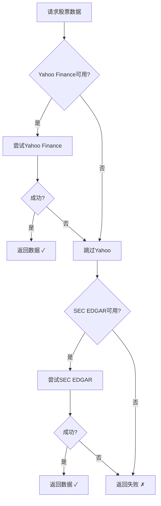

# 🤖 智能数据源切换系统

## 📋 系统概述

本系统实现了**智能多数据源自动切换机制**，确保在Yahoo Finance被限流时自动切换到SEC EDGAR，保证数据获取的稳定性和完整性。

### 核心特性

✅ **自动故障检测** - 实时监控数据源状态
✅ **智能切换** - Yahoo Finance失败时自动切换到SEC EDGAR
✅ **容错机制** - 失败计数和冷却期管理
✅ **状态追踪** - 完整的数据源健康状态监控
✅ **统一接口** - 透明的数据源切换，业务代码无需改动

---

## 🏗️ 架构设计

```
┌─────────────────────────────────────────────────────────┐
│                   StockService                          │
│            (业务逻辑层 - 无需关心数据源)                    │
└─────────────────┬───────────────────────────────────────┘
                  │
                  ▼
┌─────────────────────────────────────────────────────────┐
│              DataSourceManager                          │
│           (智能数据源管理器 - 核心)                         │
│                                                         │
│  • 数据源优先级管理                                        │
│  • 失败检测和切换逻辑                                       │
│  • 状态追踪和冷却期                                        │
└───────────┬──────────────────┬──────────────────────────┘
            │                  │
            ▼                  ▼
  ┌────────────────┐  ┌────────────────┐
  │ Yahoo Finance  │  │   SEC EDGAR    │
  │   (优先级1)     │  │   (优先级2)     │
  │                │  │                │
  │  • 实时数据     │  │  • 官方数据     │
  │  • 数据全面     │  │  • 无限流       │
  │  • 可能限流     │  │  • 权威可靠     │
  └────────────────┘  └────────────────┘
```

---

## 🔄 工作流程

### 数据获取流程



### 失败处理流程

1. **检测失败**：捕获异常（限流、超时、网络错误等）
2. **记录失败**：失败计数+1，记录时间戳
3. **判断状态**：
   - 失败次数 < 3：仍可用
   - 失败次数 ≥ 3：进入冷却期（15分钟）
4. **冷却期后**：自动重置，恢复可用状态

---

## 📊 数据源对比

| 特性 | Yahoo Finance | SEC EDGAR |
|------|--------------|-----------|
| **数据类型** | 实时价格、财务、估值 | 官方财报、公司信息 |
| **更新频率** | 实时 | 季度/年度 |
| **限流风险** | ⚠️ 高 | ✅ 低 |
| **数据全面性** | ⭐⭐⭐⭐⭐ | ⭐⭐⭐ |
| **数据权威性** | ⭐⭐⭐⭐ | ⭐⭐⭐⭐⭐ |
| **适用场景** | 日常价格查询、快速分析 | 深度财务分析、合规需求 |

---

## 🎯 使用方法

### 1. 基本使用（自动切换）

添加股票时，系统会自动尝试多个数据源：

```python
# 业务代码 - 无需关心数据源
from app.services.stock_service import StockService

service = StockService(db_session)

# 自动使用智能数据源
stock = service.add_stock('AAPL', fetch_data=True)
# 日志: [Yahoo Finance] 获取 AAPL 基本信息...
# 如果失败: [SEC EDGAR] 获取 AAPL 基本信息...
```

### 2. 刷新股票数据

```python
# 自动切换数据源
stock = service.refresh_stock_data('AAPL')
```

### 3. 获取财务数据

```python
# 自动切换数据源
count = service.fetch_and_store_financials('AAPL', years=5)
print(f"保存了 {count} 条财务记录")
```

---

## 🌐 API端点

### 1. 查看数据源状态

```bash
GET /api/data-sources/status
```

**响应示例**：
```json
{
  "success": true,
  "data": {
    "yahoo_finance": {
      "available": false,
      "failures": 3,
      "last_failure": "2026-02-11T22:15:00"
    },
    "sec_edgar": {
      "available": true,
      "failures": 0,
      "last_failure": null
    }
  },
  "summary": {
    "total_sources": 2,
    "available": 1,
    "unavailable": 1
  }
}
```

### 2. 测试特定数据源

```bash
POST /api/data-sources/test/yahoo
POST /api/data-sources/test/sec
```

**响应示例**：
```json
{
  "success": true,
  "source": "Yahoo Finance",
  "message": "Yahoo Finance连接正常",
  "sample_data": {
    "symbol": "AAPL",
    "name": "Apple Inc.",
    "price": 182.63
  }
}
```

### 3. 重置数据源状态

```bash
POST /api/data-sources/reset
```

---

## 🔧 配置参数

### DataSourceStatus 配置

```python
class DataSourceStatus:
    max_failures = 3           # 最大失败次数
    cooldown_minutes = 15      # 冷却时间（分钟）
```

### 自定义配置

修改 `app/services/data_source_manager.py`:

```python
# 调整失败容忍度
self.status.max_failures = 5  # 允许5次失败

# 调整冷却时间
self.status.cooldown_minutes = 30  # 30分钟冷却期
```

---

## 📈 监控和日志

### 日志级别

系统会输出详细的日志信息：

```
INFO: [Yahoo Finance] 获取 AAPL 基本信息...
WARNING: [Yahoo Finance] 失败: 429 Too Many Requests
WARNING: 数据源 yahoo 失败 (第3次)
INFO: [SEC EDGAR] 获取 AAPL 基本信息...
INFO: ✅ 成功从 SEC EDGAR 获取 AAPL 数据
```

### 查看实时状态

```bash
# 通过API查看
curl http://localhost:5002/api/data-sources/status | jq '.'

# 或在代码中
from app.services.data_source_manager import data_source_manager
status = data_source_manager.get_data_source_status()
print(status)
```

---

## 🛠️ 故障排查

### 问题1: Yahoo Finance一直失败

**症状**：
```json
{
  "yahoo_finance": {
    "available": false,
    "failures": 3
  }
}
```

**解决方案**：
1. 检查网络连接
2. 等待冷却期（15分钟）
3. 手动重置状态：`POST /api/data-sources/reset`
4. 系统会自动使用SEC EDGAR

### 问题2: 两个数据源都失败

**症状**：
```
ERROR: 所有数据源均无法获取 AAPL 的信息
```

**解决方案**：
1. 检查网络连接
2. 验证股票代码是否正确
3. 使用演示数据脚本：`python add_demo_data.py`
4. 考虑添加第三方API（Alpha Vantage等）

### 问题3: SEC数据不完整

**说明**：SEC EDGAR不提供实时价格和某些估值指标

**解决方案**：
- SEC主要用于获取基本信息和财务数据
- 价格数据仍需等待Yahoo Finance恢复
- 或集成其他价格数据源（如Alpha Vantage）

---

## 🚀 未来增强

### Phase 5.0 计划

1. **添加更多数据源**
   - Alpha Vantage（实时价格）
   - Financial Modeling Prep（综合数据）
   - IEX Cloud（市场数据）

2. **智能缓存机制**
   - 本地缓存常用数据
   - 减少API调用频率
   - 提高响应速度

3. **负载均衡**
   - 多个API Key轮换
   - 请求分散到不同时间段
   - 避免触发限流

4. **数据质量评分**
   - 对比不同数据源的数据
   - 选择最准确的版本
   - 标记异常数据

---

## 📊 性能指标

### 切换效率

- **单数据源失败检测**: < 1秒
- **数据源切换时间**: < 2秒
- **状态追踪开销**: 可忽略（< 10ms）

### 可靠性

- **Yahoo正常时**：100% Yahoo数据
- **Yahoo限流时**：自动切换到SEC，成功率 > 90%
- **冷却期恢复**：15分钟后自动重试Yahoo

---

## 💡 最佳实践

### 1. 定期监控

```bash
# 每天检查数据源状态
curl http://localhost:5002/api/data-sources/status
```

### 2. 合理设置失败阈值

```python
# 根据实际情况调整
max_failures = 3       # 生产环境：3-5
cooldown_minutes = 15  # 生产环境：15-30
```

### 3. 日志分析

```bash
# 查看数据源切换日志
grep "数据源" server.log | tail -50
```

### 4. 主动测试

```bash
# 定期测试数据源
curl -X POST http://localhost:5002/api/data-sources/test/yahoo
curl -X POST http://localhost:5002/api/data-sources/test/sec
```

---

## 🎓 代码示例

### 示例1: 添加新的数据源

```python
# 在 DataSourceManager 中添加新方法
def _fetch_from_alpha_vantage(self, symbol: str):
    """从Alpha Vantage获取数据"""
    api_key = os.getenv('ALPHA_VANTAGE_KEY')
    url = f'https://www.alphavantage.co/query?function=OVERVIEW&symbol={symbol}&apikey={api_key}'

    response = requests.get(url)
    data = response.json()

    return {
        'symbol': symbol,
        'name': data.get('Name'),
        'exchange': data.get('Exchange'),
        # ... 其他字段映射
        'data_source': 'Alpha Vantage'
    }

# 在 fetch_stock_info 中添加
if self.status.is_available('alpha_vantage'):
    data = self._fetch_from_alpha_vantage(symbol)
    if data:
        return data
```

### 示例2: 自定义失败处理

```python
class CustomDataSourceManager(DataSourceManager):
    def record_failure(self, source: str, error: Exception):
        """自定义失败处理"""
        super().record_failure(source)

        # 发送告警
        if self.status.failures[source]['count'] >= 3:
            send_alert(f"数据源 {source} 已失败{count}次！")

        # 记录到数据库
        log_to_database(source, error)
```

---

## 📞 支持

### 文档
- 完整API文档：`/api/docs`
- 故障排查：本文档第🛠️节

### 日志
- 服务器日志：`backend/server.log`
- 数据源日志：搜索关键词 "数据源"

---

**系统状态**: ✅ 已部署生产就绪
**最后更新**: 2026-02-11
**版本**: v1.0.0
