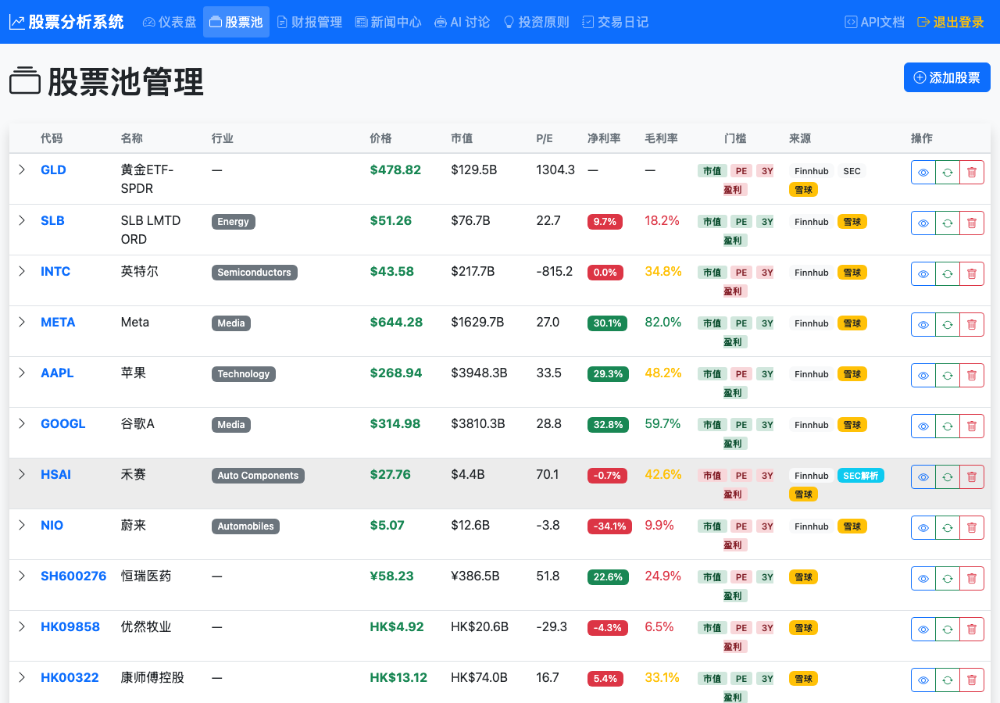
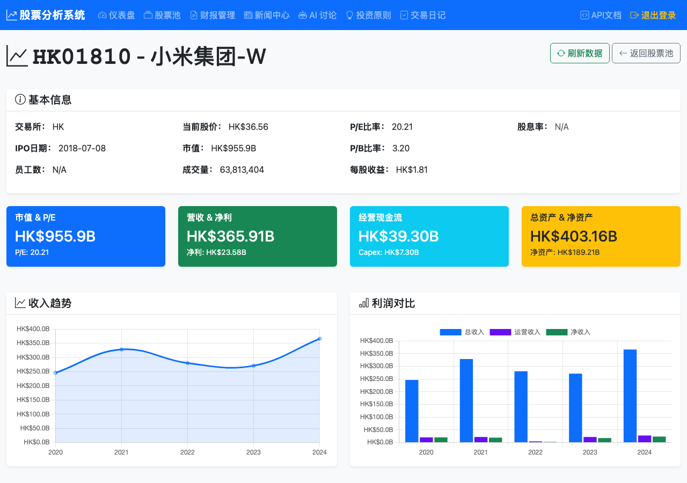
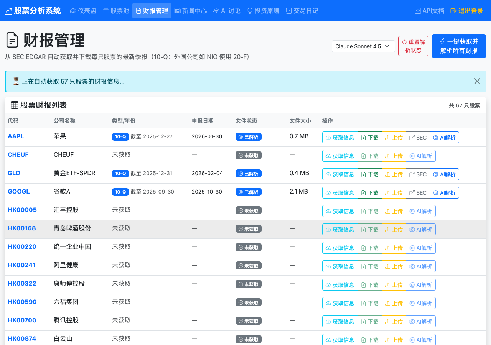
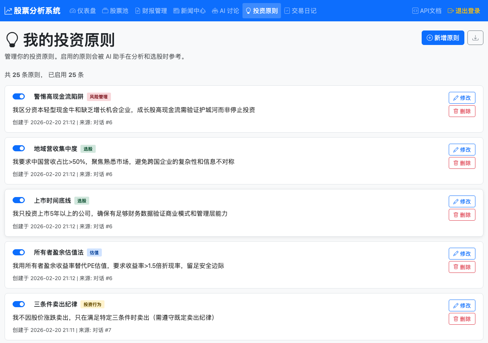
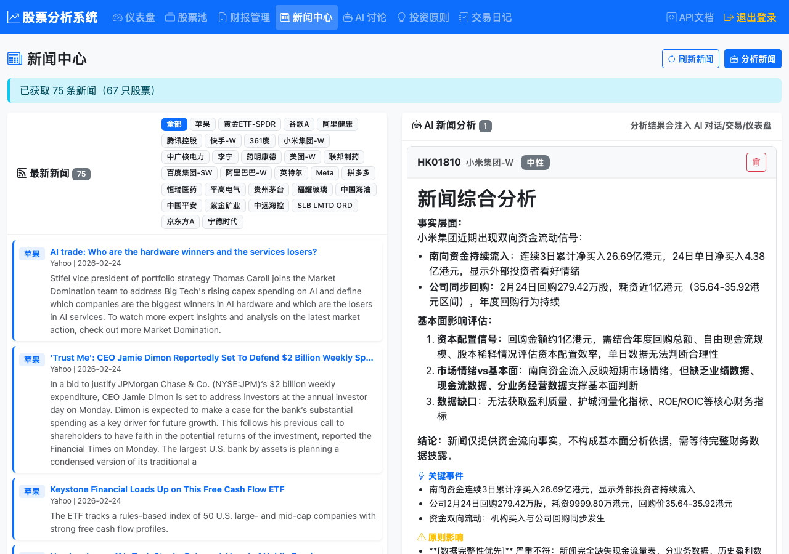
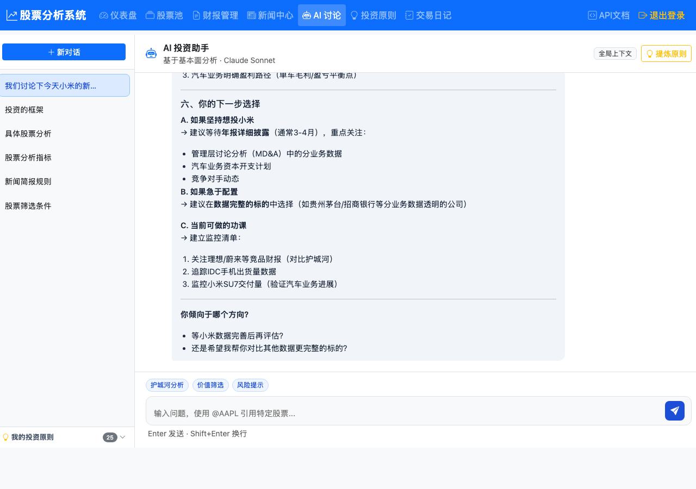
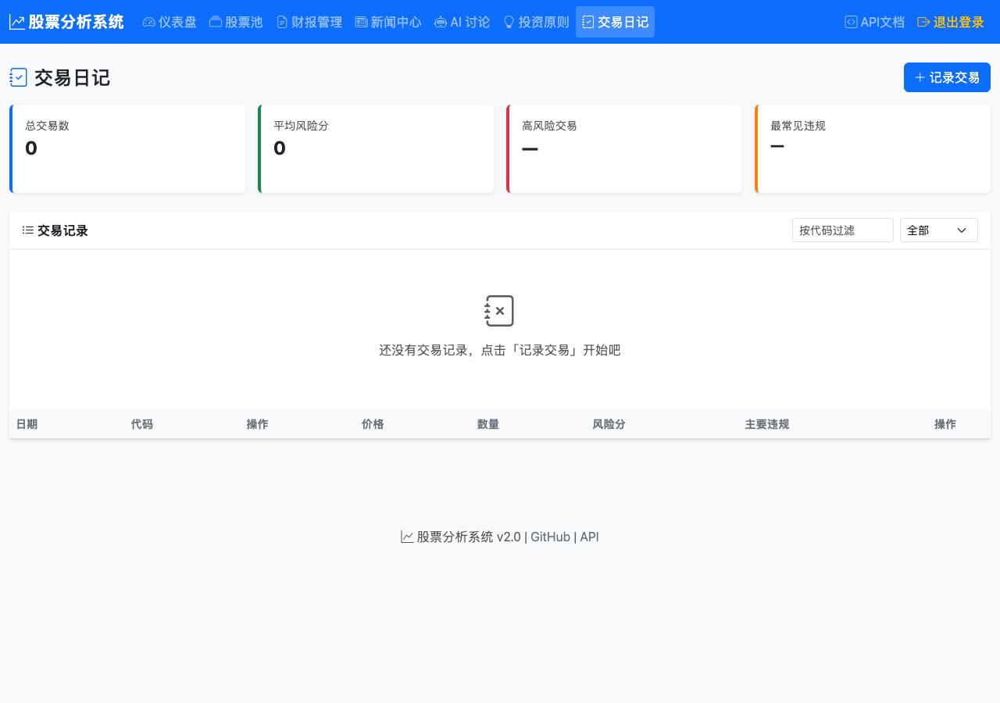
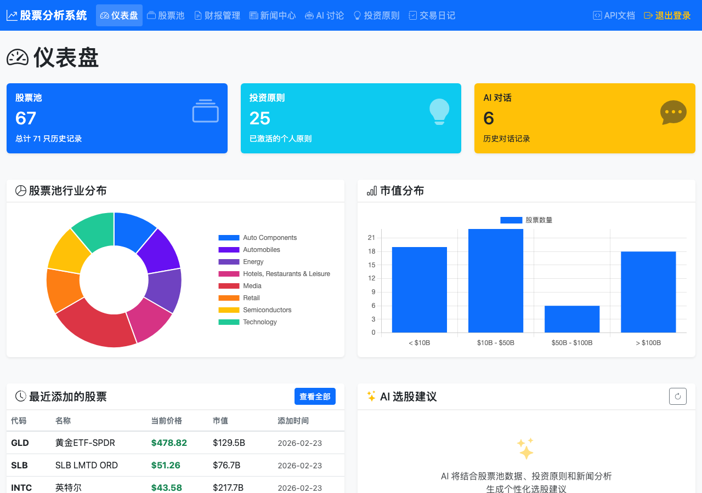

# 股票分析系统 - 用户使用手册

## 核心理念

本系统的分析质量完全取决于**数据的完整性和准确性**。在使用 AI 分析功能之前，请务必确保股票的基本面数据已就绪。

---

## 第一步：选股（股票池）

进入「股票池」页面，点击右上角「添加股票」，输入代码和名称。系统支持三个市场：

| 市场 | 代码格式 | 示例 |
|------|---------|------|
| 美股 | 英文代码 | AAPL, GOOGL, META |
| A 股 | SH/SZ + 6位数字 | SH600519, SZ000333 |
| 港股 | HK + 5位数字 | HK01810, HK00700 |

添加后系统会自动尝试拉取基础信息和实时数据。支持搜索功能：输入中文名、拼音首字母或代码均可搜索。



股票列表中的「门槛」列（市值、PE、3Y、盈利）可以快速判断数据完整度。「来源」列显示数据来自 Finnhub、雪球还是 SEC。展开后的财务数据支持**点击编辑**（鼠标悬停出现编辑图标）。

工具栏还提供：AI 批量补全、手动上传、导出/导入 JSON 等功能。

---

## 第二步：确认数据完整（关键步骤）

添加股票后，**必须点进股票详情页检查财务数据是否成功获取**。确认以下数据存在且合理：

- 营收、净利润、EPS
- ROE、利润率
- 现金流数据
- 市盈率、市净率



如上图，小米的基本信息、估值指标、收入趋势和利润对比图表都已就绪，说明数据完整。

### 股票详情页功能

- **关键指标概览**：市值&PE、营收&净利润、经营现金流、总资产四张卡片
- **财务趋势图表**：收入趋势图、利润对比图、资产负债趋势图
- **导出财务数据**：右上角下载按钮
- **内在价值估算**：点击"计算估值"，系统用 DCF/EPV/Graham/相对估值等多种方法计算内在价值，显示综合内在价值区间和安全边际（MOS）百分比

### 数据源优先级

1. **雪球（首选）**：A 股和港股的主要数据来源
2. **Finnhub / SEC EDGAR**：美股数据来源
3. **手动上传财报**：当自动数据源缺失或不准确时的补充方案

### 数据缺失怎么办？

如果自动获取的数据不完整（部分股票较常见），有两种补救方式：

**方式一：上传财报让 AI 提取**

进入「财报管理」页面。美股会自动从 SEC EDGAR 获取季报（10-Q）和年报（10-K）。港股/A股可以手动上传 PDF 财报，然后点击「AI 解析」，系统会用 Claude 自动提取关键财务指标填入数据库。



**方式二：手动修改**
- 在股票详情页直接编辑财务数据字段
- 适用于个别数值的修正或补充

> **再次强调：** 数据不完整时，AI 的分析结论可能不可靠。系统会在分析中标注数据缺失，但不会阻止你继续操作。确保数据完整是用户自己的责任。

---

## 第三步：设置投资原则

投资原则是 AI 分析的"价值观框架"，会被注入到新闻分析、交易评审、AI 对话等所有环节。



### 设置方式

- **与 AI 对话生成**：在「AI 讨论」页面描述你的投资理念，让 AI 帮你提炼。注意：**系统只提取 AI 最后一条回复的内容**作为原则，所以请在对话结束时让 AI 给出完整总结，再点击右上角「提炼原则」按钮。
- **手动编辑**：在「投资原则」页面直接添加、修改或删除原则。每条原则可以单独启用/禁用。

### 原则分类

| 类别 | 说明 | 示例 |
|------|------|------|
| 选股 (selection) | 选择标的的标准 | 连续盈利验证、护城河量化、上市时间底线 |
| 估值 (valuation) | 买卖价格判断 | 现金流核心验证、所有者盈余估值法 |
| 风险 (risk) | 风险控制规则 | 警惕高现金流陷阱、仓位上限 |
| 行为 (behavior) | 投资纪律 | 数据完整性优先、主题服从基本面 |

---

## 第四步：每日新闻分析（新闻中心）

新闻分析是时效性数据，**只保留当天的分析结果**。每天使用前需要重新操作：

1. 进入「新闻中心」页面
2. 点击右上角「刷新新闻」—— 系统从东方财富（A股/港股）和 Finnhub（美股）抓取当日新闻
3. 点击「分析新闻」→ 勾选要分析的股票 → 确认
4. 等待 AI 分析完成（每只股票约 20-30 秒）



如上图，左侧显示抓取到的最新新闻列表，右侧「AI 新闻分析」区域展示分析结果：情绪判断（看涨/看跌/中性）、综合分析摘要、关键事件、以及与你的投资原则的关联评估。

> **注意：** 分析结果会注入 AI 对话/交易/仪表盘。顶部提示文字也说明了这一点。如果当天没有执行新闻分析，其他页面的新闻相关内容会显示"暂无"。隔天后当天的分析会自动清除。

---

## 第五步：使用 AI 功能

完成以上准备后（股票数据完整 + 投资原则已设 + 当日新闻已分析），即可使用以下三个核心功能：

### AI 对话

与 AI 投资助手讨论任意股票问题。AI 会自动结合：股票池数据 + 财务数据 + 投资原则 + 当日新闻分析。



- 左侧是历史对话列表，可以创建多个对话分主题管理
- 输入框支持 `@AAPL` 格式引用特定股票
- 底部有「护城河分析」「价值筛选」「风险提示」快捷按钮
- 右上角「提炼原则」可以从对话中提取投资原则

### 交易日记

记录你的买卖决策。AI 会自动评审每笔交易是否符合你的投资原则，并考虑当日新闻对决策合理性的影响。



页面分为四个统计区域：**用户交易统计**（总资金、总资产、持仓价值、可用现金、风险分等）、**AI 模拟账户**（评分系统）、**TA 模拟账户**（TradingAgents）、**交易记录/历史**。

点击「记录交易」，填入股票代码、买/卖、价格、数量和理由，系统会：
- 自动计算风险评分
- AI 评审交易是否违反投资原则
- 统计历史交易数据（总交易数、平均风险分、高风险交易占比）

**AI 交易讨论**：点击任意交易记录，右侧弹出 AI 讨论侧边栏，可与 AI 多轮对话深入分析该笔交易的合理性。

### TradingAgents (TA) 多Agent辩论交易

系统集成了 TradingAgents 框架，模拟真实投资机构的多角色辩论决策流程：

- 多个 AI Agent（基本面分析师、技术分析师、新闻分析师、研究员等）各自独立分析
- Agent 之间进行辩论，最终由"基金经理"Agent 综合做出买入/卖出/持有决策
- 复用本地数据库中的财务数据和新闻分析，减少外部 API 调用

**使用方式**：
1. 在首页仪表盘点击"TA 交易"按钮，选择要分析的股票
2. 等待分析完成（每只约 1-3 分钟）
3. 评分表"TA 交易"列显示建议
4. 交易日志页面查看 TA 交易历史和持仓

> TA 分析消耗较多 API 额度，建议先完成新闻分析后再执行，每天一次即可。

### Dashboard 仪表盘

首页仪表盘提供整体概览、评分系统和 AI 选股建议。



- 顶部卡片：股票池数量、投资原则数、AI 对话记录
- 中间图表：行业分布和市值分布
- **每日交易建议**：5 维度评分表，展示所有股票的评分和操作建议
- **工具栏按钮**：
  - 「执行 AI 交易」— 基于评分触发 AI 模拟交易
  - 「TA 交易」— 选择股票执行 TradingAgents 多Agent辩论
  - 「评分权重设置」（齿轮图标）— 自定义 5 维度权重滑块
  - 「估值参数设置」（计算器图标）— 自定义 DCF 折现率、增长率等
- 右下角「AI 选股建议」：AI 综合分析整个股票池，推荐 2-3 只当前最值得关注的股票

---

## 每日工作流（建议）

```
1. 打开「新闻中心」→ 刷新新闻 → 分析新闻（选择关注的股票）
2. 回到「仪表盘」→ 刷新评分 → 查看 AI 选股建议
3. 可选：执行 AI 交易 / TA 交易，让两套 AI 系统给出模拟交易建议
4. 对感兴趣的股票进入「AI 讨论」深入分析，或在详情页查看内在价值
5. 做出交易决策后记录到「交易日记」，与 AI 讨论交易合理性
```

---

## 常见问题

**Q：AI 分析一直转圈不出结果？**
A：刷新页面（Cmd+Shift+R）重试。单只股票分析通常 20-30 秒完成，超过 2 分钟会自动超时。

**Q：新闻获取为 0 条？**
A：非交易日或当天该股票暂无新闻属正常情况。美股需要 Finnhub API Key（可在登录页填写，或使用服务器默认配置），A股/港股使用东方财富免费接口。

**Q：为什么 AI 分析总说"数据不足"？**
A：检查该股票的财务数据是否完整。进入股票详情页查看，缺失的数据可以通过上传财报或手动补充。

**Q：投资原则从 AI 对话提取不准确？**
A：系统只提取 AI 最后一条消息的内容。建议在对话末尾明确要求 AI 用完整格式总结原则，然后再点击「提炼原则」。提取后可在原则页面手动微调。

**Q：昨天的新闻分析今天还能用吗？**
A：不能。新闻分析只保留当天的，隔天自动清除。每天需要重新获取和分析新闻。
